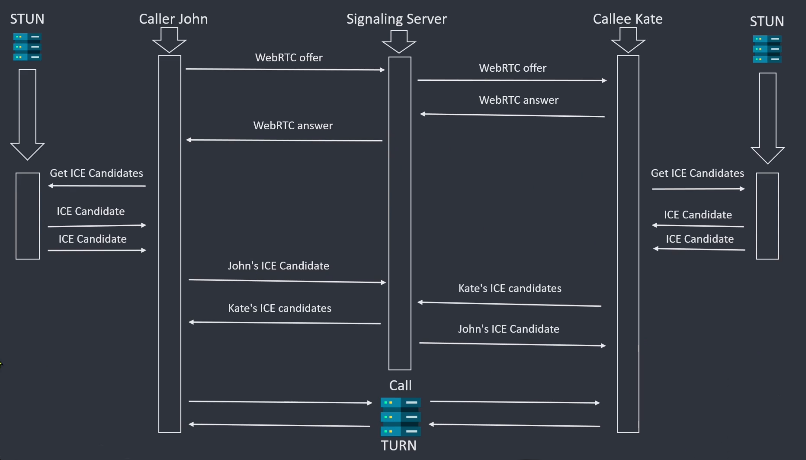

# zoom-clone

Sample application demonstrating WebRTC with React SPA.

## Theory - What is **WebRTC**?

WebRTC is an open framework for the web that enables Real-Time Communications (RTC) capabilities in the browser.

#### What is a **STUN** server?

- STUN (Session Traversal Utilities for NAT) server allows clients to discover their public IP address and the type of NAT they are behind. This information is used to establish the media connection.
- In 15-20% of cases STUN server will fail, and to establish a connection between the peers, we will need a TURN server.

#### What is a **TURN** server?

- TURN (Traversal Using Relay NAT) server implements a protocol for relaying network traffic.
- TURN servers will be used if the STUN server fails.
- TURN servers will be used to assist in establishing connections between the peers.
- TURN Servers are not public because of the costs they can generate because of the traffic going through them.

#### What is **SDP**?

- The SDP (Session Description Protocol) is a format for describing multimedia communication sessions for session announcement and invitation.
- It does not deliver the media data but is used for negotiation between peers of various audio and video codecs, source addresses, and audio and video timing information.

#### What are **ICE** candidates?

- ICE (Interactive Connectivity Establishment) is a standard method of NAT traversal used in WebRTC.
- As well as exchanging information about the media (discussed above in Offer/Answer and SDP), peers must exchange information about the network connection. That is an ICE candidate and details the available methods the peer can communicate (directly or through a TURN server). Typically, each peer will propose its best candidates first, making their way down the line toward their worse candidates. Ideally, candidates are UP (since it's faster, and media streams can recover from interruptions relatively quickly), but the ICE standard also allows TCP candidates.
