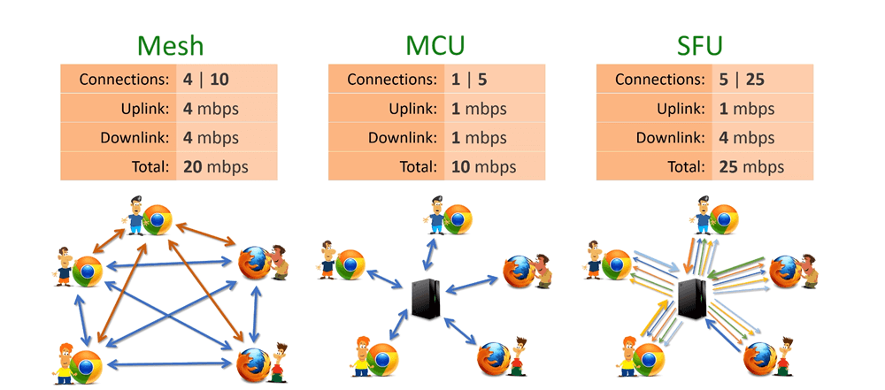

# Zoom Clone

Sample application demonstrating WebRTC with React SPA.

## You can run app with docker compose

- **start** - docker-compose up
- **start in background** - docker-compose up -d
- **stop** - docker-compose down

### App URL

- front-end - <http://localhost:3000>
- back-end - <http://localhost:8080>

## Theory - What is **WebRTC**?

WebRTC is an open framework for the web that enables Real-Time Communications (RTC) capabilities in the browser.

### What is a **STUN** server?

- STUN (Session Traversal Utilities for NAT) server allows clients to discover their public IP address and the type of NAT they are behind. This information is used to establish the media connection.
- In 15-20% of cases STUN server will fail, and to establish a connection between the peers, we will need a TURN server.

### What is a **TURN** server?

- TURN (Traversal Using Relay NAT) server implements a protocol for relaying network traffic.
- TURN servers will be used if the STUN server fails.
- TURN servers will be used to assist in establishing connections between the peers.
- TURN Servers are not public because of the costs they can generate because of the traffic going through them.

### What is **SDP**?

- The SDP (Session Description Protocol) is a format for describing multimedia communication sessions for session announcement and invitation.
- It does not deliver the media data but is used for negotiation between peers of various audio and video codecs, source addresses, and audio and video timing information.

### What are **ICE** candidates?

- ICE (Interactive Connectivity Establishment) is a standard method of NAT traversal used in WebRTC.
- As well as exchanging information about the media (discussed above in Offer/Answer and SDP), peers must exchange information about the network connection. That is an ICE candidate and details the available methods the peer can communicate (directly or through a TURN server). Typically, each peer will propose its best candidates first, making their way down the line toward their worse candidates. Ideally, candidates are UDP (since it's faster, and media streams can recover from interruptions relatively quickly), but the ICE standard also allows TCP candidates.

## WebRTC Architectures

- Mesh (Peer to Peer) this is the simplest one to set up and involves peer to peer. Each participant sends their stream directly to every other participant without going through a media server, and the participant also receives streams from every other user. So if there are 4 participants, you would send your stream to the other three users and receive all of their streams. As you can imagine, this approach does not scale well past more than six users because it requires your computer to receive and process many audio and video streams. Mesh supports up to 4–6 participants and does not require a central media server, making it easier to set up, but does not scale.
- MCU (Multipoint Conferencing Unit) supports a larger number of participants than Mesh. Each participant sends their stream to a server, and the server decodes each participant’s stream and creates a single new stream from each of the streams it has received. It finally sends this stream back to all of the participants. Compared to a Mesh architecture, the MCU moves a lot of the processing from the client to the server. The disadvantage of the MCU approach is expensive server costs since decoding each stream and re-encoding the stream to send it back to every client can be computationally intensive. Also, there may be more latency in sending the recomposed stream back to each client because a server is involved.
- SFU (Selective Forwarding Unit) this is a more popular approach than MCU when there is a need to scale to more than 4–6 participants. This approach also involves a server. The difference is that each participant sends their stream to the server, and the server sends each stream that it receives back to all of the other participants. For example, if there are 6 participants, each participant will receive five streams from the other users. The great thing about the SFU is that it can scale, and you have more flexibility over the UI. On the client, you can reorganize the order of participants, whereas this is not possible in the MCU. That can allow you to have custom layouts and change them while live streaming.
